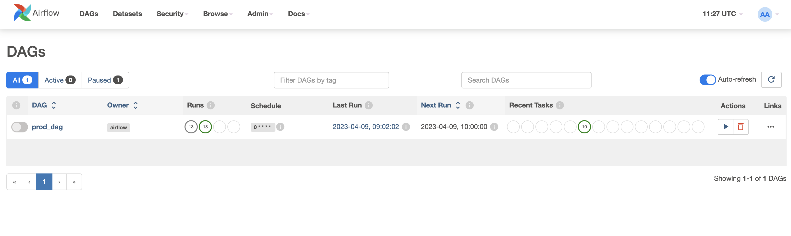
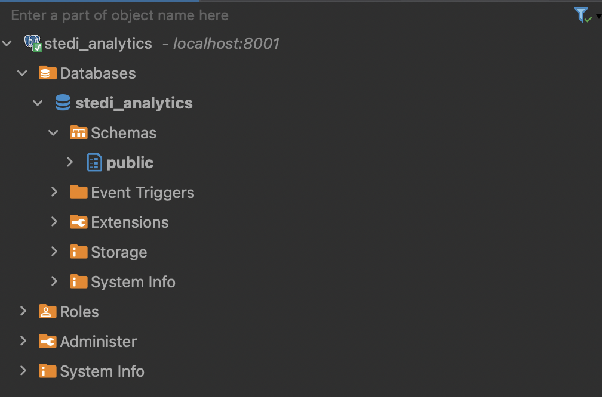
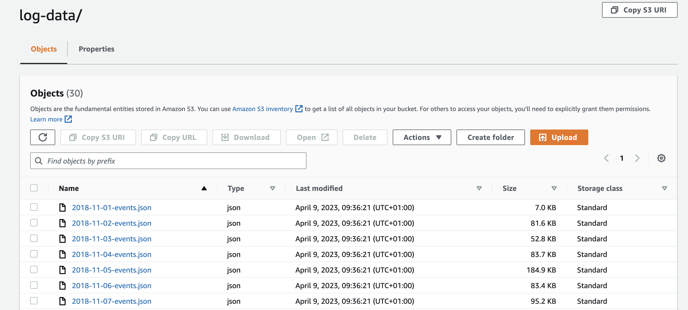
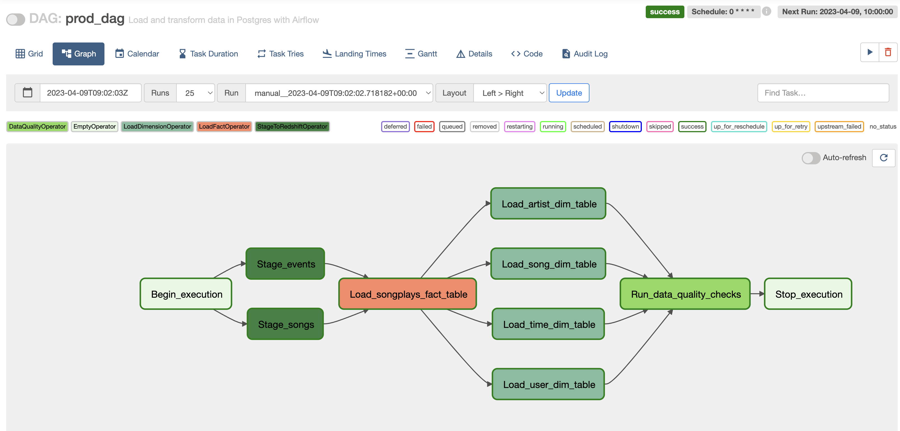
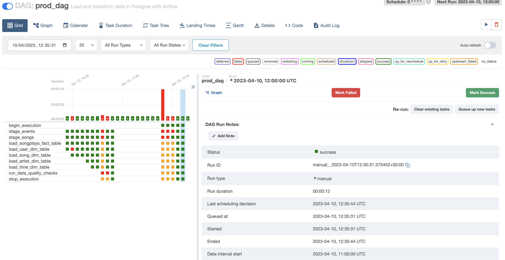
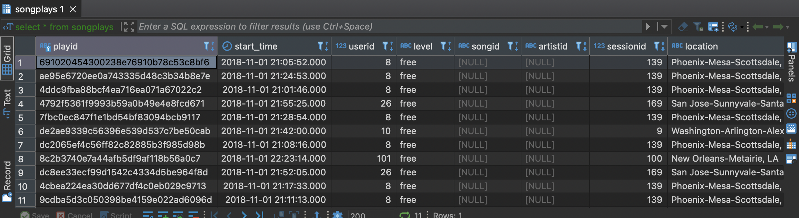

# Introduction
A music streaming company, Sparkify, has decided that it is time to introduce more automation and monitoring to their data warehouse ETL pipelines and come to the conclusion that the best tool to achieve this is Apache Airflow.

They have decided to bring you into the project and expect you to create high grade data pipelines that are dynamic and built from reusable tasks, can be monitored, and allow easy backfills. They have also noted that the data quality plays a big part when analyses are executed on top the data warehouse and want to run tests against their datasets after the ETL steps have been executed to catch any discrepancies in the datasets.

The source data resides in S3 and needs to be processed in Sparkify's data warehouse in Amazon Redshift. The source datasets consist of JSON logs that tell about user activity in the application and JSON metadata about the songs the users listen to.

# Set up 
To create a free and reproducible development environment, we'll create a Dockerised Airflow deployment that also has an additional Postgres database (to mimic Redshift) to run queries on. 

However, we'll also write the code to run in Redshift. For this, we'll create a new IAM user and a service role and save their credentials in Airflow. We'll also create a Redshift Serverless cluster. We'll call the AWS connection `aws-redshift`. We'll call the Redshift connection `redshift`. This way, we have both Redshift-specific `COPY` syntax and a Postgres version. 

We'll use the default `docker-compose.yaml` from the Airflow website. We add another Postgres database to it and map our local machine's port 8001 to its 5432 (the default Postgres port). This means we can access our Postgres database at `localhost:8001`. 

We use `docker compose up -d` to bring up our Airflow + target database.

Navigating to `localhost:8080`, we can log in and see the Airflow UI:

Additionally, we can connect to our target database in DBeaver:

Finally, we'll copy data from a public S3 bucket into our own S3 bucket. This data will describe events, stored in logs, as well as songs (remember, we're working for a music streaming company!) 

Below is an example of our log data:

# Airflow
## Summary 
The aim of the project is to write an Airflow DAG that will load JSON data from our `songs-data/` and `logs-data/` folders on S3 into staging tables. 

Next, we'll create the following fact and dimension tables:

* a fact table describing songplays (i.e. song and event data combined)
* dimension tables about:
    * users
    * songs
    * artists
    * dates

The final step will be to run data quality checks on our tables.

Setting up our skeleton structure and putting in dependencies, our DAG looks as follows:

## Implementation
The bulk of the coding will be about implementing custom operators for the following steps:

* Staging the data 
* Loading fact and dimension tables
* Performing data quality checks

### The staging operator
The purpose of the staging operator is to load JSON files from an S3 bucket into our staging tables. It will run a `COPY` command of set of files into a table in the database, so we need to tell it where in S3 the data is and which table to load to. 

This operator needs to distinguish between JSON files and it will need to be able to perform backfills, using timestamped filenames.

We'll create our staging tables, `staging_events` and `staging_songs`, using queries from `create_tables.sql`. 

Next, in `plugins/operators/stage_redshift.py`, we'll work on our custom operator. It'll need to execute a parameterised `COPY` command of JSON data in an S3 bucket into a Postgres table. The key components will be 

* The connection to the target database
* The `COPY` command that's able to grab JSON data
* The name of the target table

We'll first configure a connection to our target database. Because we've used Docker compose, all containers are on the same network. In our compose file, we'll set `POSTGRES_HOST_AUTH_METHOD: trust` to enable easy (but insecure) connections to our Postgres database. Now, we can add a connection where the host is simply `host.docker.internal` and the port 8001.

Next, the `COPY` command. We don't have access to Redshift, nor to an RDS Postgres instance, so we can't use the `aws_s3` extension, either. Instead, we'll simply 

1. get the file with the S3 hook
2. turn the resulting `StreamingBody` object into a table
3. commit this table to the database using SQLAlchemy

### The fact and dimension operators
Here, we need to execute some SQL statements saved in `sql_queries.py`. We'll select some data from our staging tables and load them into a fact table (`songplays`) and several dimension tables.

For our fact table, we'll always insert and never replace the data. This is because fact tables tend to be very big, so we'd rather avoid replacing the whole thing. The `LoadFactOperator` will take a connection ID, a target table, and a query as its arguments.

The `LoadDimensionOperator` is similar, except you can choose whether to truncate the table first. This is because dimension tables are generally smaller, so it may be useful to truncate.

### The data quality operator
Finally, we want to be able to execute data quality checks to ensure that the data being loaded is of high quality.

Here, as an example, I've implemented an operator that will check that each of the tables contains rows. The test - and therefore the entire DAG -will fail if the number of rows is 0. It's possible to also add aditional checks.

# Summary
We can now run our DAG end to end. 

Our staging tasks will fetch data from S3, turn them into a tabular format, and load them into the staging tables.

The fact and dimension tasks will take data from the staging tables and create fact and dimension tables.

The data quality task ensures that each of the tables we choose to test actually contains rows.

# Demo
In this demo, we'll grab one file each for songs and events, create our fact and dimension tables, and run data quality checks.

Having triggered the DAG manually, we can see it ran successfully:

And, inspecting our tables, we can see they have been populated! For example, here is `songplays`:

And this means the data quality check was also passed.